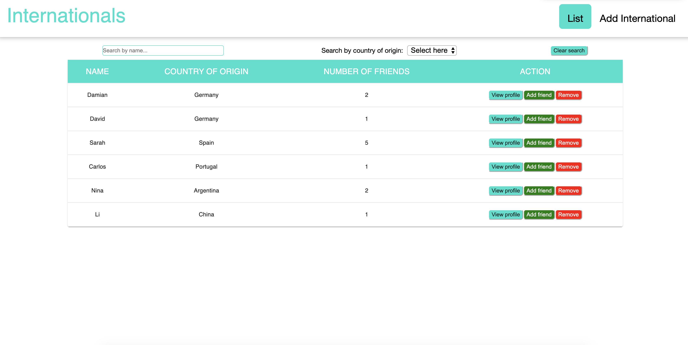

# Internationals app

The **Internationals** app was a coding challenge giving by the company [Localyze](https://www.localyze.de/)

## Table of Contents

- [Introduction](#introduction)
- [Technologies](#technologies)
- [Setup](#setup)
- [Images](#images)

## Introduction

With this app, one can add an employee (we call "internationals") with thier country of origin. After adding one can define friendships with already existing members. Friendship is a two way relationship. For eg:- When David adds Sarah as a friend, Sarah is also a friend of David.

### Functionalities

- One can add an International using a form and remove
- One can add friends/unfriend by choosing.
- The index page shows all the existing members with thier country of origin, number of friends and links to thier profile
- When viewing a profile, it displays name and country along with links to his/her friends page

## Technologies

The app was built [create-react-app](https://create-react-app.dev/) and MERN Stack:

- MongoDB
- Express
- React
- Node.js

### Additional dependencies

- cors
- mongoose
- react-router-dom
- react-scripts
- prop-types
- styled-components
- material-ui

### Dev dependencies

- cypress
- eslint-plugin-cypress
- nodemon
- npm-run-all

### Development tools

- Visual Studio Code
- Postman
- MongoDB compass

## Setup

1. Clone the repository

```
https://github.com/manojsatya/Internationals.git
```

2. Install the dependencies

```
npm install
```

3. You need to install MongoDB or already installed. It can reachable by default port [http://localhost:27017](http://localhost:27017)

4. Run the app using below command

```
npm start
```

5. Run cypress test by running below command

```
npm run cypress
```

Click Run all specs to run all test or click individual spec

## Images

### Index page



### Define friendship page


### Profile page


